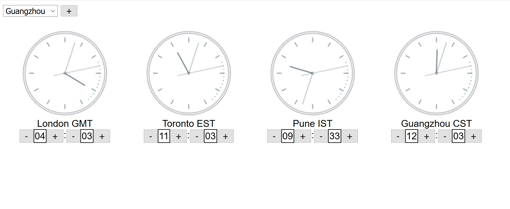

# World Clock

This is a small webapp that helps you deal with timezones.



To run it you have to:

```
npm i
node server.js
```

and then hit the server.

## Persistence of display

The persistence is achieved through a cookie: `worldclock`

